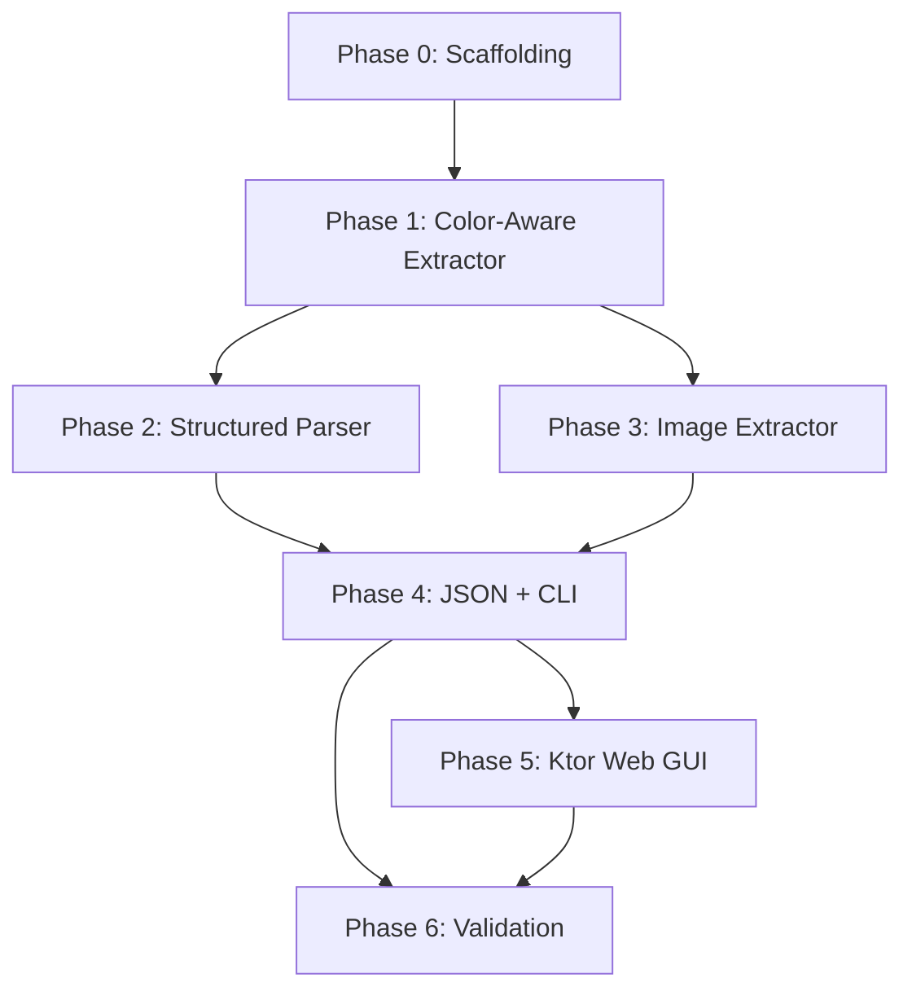

# QuizOnConvertor — Project Plan

> **Purpose**: Extract structured quiz data from AMRITA-format PDF exam papers and produce
> JSON conforming to the QuizOn Django data models, for bulk-import into the SQLite database.
>
> **Runtime**: Kotlin/JVM · Gradle 9.6 · Kotlin 2.4.0 (NO KMP — Ktor server is plain JVM, no multiplatform needed)  
> **Target Artifact**: One `{section_name}.json` per section — ready for a custom Django management command.

---

## Table of Contents

1. [Context & Specimen Analysis](#1-context--specimen-analysis)
2. [Data Models & JSON Schema](#2-data-models--json-schema)
3. [Architecture Overview](#3-architecture-overview)
4. [Phase 0 — Project Scaffolding](#phase-0--project-scaffolding)
5. [Phase 1 — Color-Aware PDF Text Extractor](#phase-1--color-aware-pdf-text-extractor)
6. [Phase 2 — Structured Parser (Text → Data Classes)](#phase-2--structured-parser-text--data-classes)
7. [Phase 3 — Image Extraction Pipeline](#phase-3--image-extraction-pipeline)
8. [Phase 4 — JSON Serialization & CLI Output](#phase-4--json-serialization--cli-output)
9. [Phase 5 — Ktor Web GUI & API](#phase-5--ktor-web-gui--api)
10. [Phase 6 — Validation, Edge Cases & Polish](#phase-6--validation-edge-cases--polish)
11. [Dependency Matrix](#dependency-matrix)
12. [File Map (Planned)](#file-map-planned)
13. [Resolved Decisions](#resolved-decisions)

---

## 1. Context & Specimen Analysis

### 1.1 Source PDF Format

The specimen file **`Sem1 Maths1.pdf`** (10 pages, ~794 KB) is a machine-generated exam
export from the AMRITA online examination platform. Its structure is:

```
Section Header          →  "Sem1 Maths1" / Section Id / Number / Marks / etc.
├── Sub-Section Header  →  Sub-Section Number / Id / Shuffling
│   ├── Question Block  →  Question Number / Id / Type / Marks
│   │   ├── Question Text (or empty if image-only)
│   │   ├── Options (prefixed by long numeric ID like 6406533039095.)
│   │   │   └── Option text (may be empty if image-only)
│   │   ├── [For SA] Response Type / Possible Answers
│   │   └── [For COMPREHENSION] Sub-questions (recursive)
│   └── ...more questions
└── ...more sub-sections
```

### 1.2 Key Observations from Specimen

| Property | Finding |
|----------|---------|
| **Question types** | `MCQ`, `MSQ`, `SA` (Short Answer / NAT), `COMPREHENSION` (parent with sub-questions) |
| **Images** | 88 total across 10 pages. 12×12 px images = radio/checkbox icons (filter out). Larger images = question diagrams, option images, graphs |
| **Question text** | Sometimes embedded as text, sometimes entirely image-based (only option IDs visible with no text) |
| **Options** | Prefixed with a numeric ID (e.g., `6406533039095.`), followed by text or nothing (image option) |
| **SA answers** | Appear under `Possible Answers :` block as a plain number |
| **COMPREHENSION** | Parent question with `Question Numbers : (53 to 54)`, contains sub-questions that follow normal patterns |
| **Section boundary** | Detected by lines like `Sem1 Statistics1` or `Section Id : XXXXXXX` — signals end of current subject |
| **Page breaks** | Questions can span pages (e.g., options on page 3 continuing from question on page 2) |
| **Marks** | `Correct Marks : N` per question. Negative marks not shown in specimen (default 0) |

### 1.3 Answer Key Encoding — COLOR SYSTEM ⭐

**Critical discovery**: The PDF encodes correct/incorrect answers via **text color** (RGB non-stroking color in the PDF content stream). This was verified character-by-character across all 10 pages:

| Color | RGB Value | Meaning | Where Found |
|-------|-----------|---------|-------------|
| **Green** | `(0.0, 0.50196, 0.0)` = `rgb(0, 128, 0)` | ✓ **Correct** option / correct NAT answer | Option text lines, SA "Possible Answers" values |
| **Red** | `(1.0, 0.0, 0.0)` = `rgb(255, 0, 0)` | ✗ **Incorrect** option | Option text lines |
| **Black** | `(0,)` = grayscale 0 | Normal text | Question text, headers, labels, structural metadata |

**Verified examples from specimen** (Page 2-3, Question 46 MSQ):

```
GREEN ✓  6406533039095.  Floyd-Warshall algorithm is used for all pair shortest paths.
GREEN ✓  6406533039096.  The Shortest path problem is not applicable to a graph with a negative weight cycle.
GREEN ✓  6406533039097.  Bellman-Ford algorithm is used for single source shortest path.
RED   ✗  6406533039098.  Dijkstra's algorithm is used for all pair shortest paths.
```

**For SA/NAT questions**, the number under `Possible Answers :` is also green-colored, confirming the answer value.

**For image-only options** (no text, just option ID), the icon image's colorspace differs:
- `CalRGB` colorspace → filled/green (correct)
- `DeviceRGB` colorspace → empty/default (incorrect)

This provides a dual-signal for correctness even when option text is absent.

### 1.4 Type Mapping to Django Models

| PDF `Question Type` | Django `q_type` | Notes |
|---------------------|-----------------|-------|
| `MCQ` | `mcq` | Single correct, 4 options typical |
| `MSQ` | `msq` | Multiple correct (`Max. Selectable Options` field) |
| `SA` (Numeric) | `nat` | Numerical Answer Type; answer under `Possible Answers` |
| `COMPREHENSION` | (parent) | Not a question itself; children are `mcq`/`nat`/`msq` |

---

## 2. Data Models & JSON Schema

### 2.1 Kotlin Data Classes (kotlinx.serialization)

These mirror the Django models and serialize directly to the JSON interchange format.

```kotlin
// === Interim JSON Schema ===

@Serializable
data class QuizExport(
    val subject: SubjectData,
    val paper: QuizPaperData,
    val questions: List<QuestionData>,
    val tags: List<TagData> = emptyList()
)

@Serializable
data class SubjectData(
    val subject: String,           // "Mathematics for Data Science I"
    val code: String,              // "MAT101" — CLI/GUI parameter
    val level: String,             // "Foundation" | "Diploma" | "Degree"
    val description: String = "",
    val icon: String = ""
)

@Serializable
data class QuizPaperData(
    val title: String,             // "Sem1 Maths1"
    val year: Int,                 // CLI/GUI parameter
    val term: String,              // "jan" | "may" | "sept" — CLI/GUI parameter
    val examType: String,          // "quiz1" | "quiz2" | "endterm" — CLI/GUI parameter
    val totalDurationSeconds: Int = 0,
    val isPublished: Boolean = false
)

@Serializable
data class QuestionData(
    val text: String,              // Question text (may be empty if image-only)
    val qType: String,             // "nat" | "mcq" | "msq"
    val order: Int,                // Sequential within paper
    val image: String? = null,     // Relative path to extracted image file
    val correctAnswer: JsonElement? = null,  // For NAT: {"value": 3}, MCQ/MSQ: derived from options
    val explanation: String = "",
    val marks: Int,
    val negativeMarks: Int = 0,
    val codeSnippet: String? = null,
    val natTolerance: Double? = null,
    val referenceTags: List<String> = emptyList(),
    val options: List<OptionData> = emptyList(),
    val sourceQuestionId: String = "",    // Original platform question ID for traceability
    val sourceQuestionNumber: Int = 0,    // Original numbering in PDF
    val comprehensionParentId: String? = null  // Links sub-questions to parent
)

@Serializable
data class OptionData(
    val serial: Int,               // 1, 2, 3, 4
    val text: String,              // Option text
    val image: String? = null,     // Relative path to extracted image file
    val isCorrect: Boolean = false, // ← EXTRACTED FROM TEXT COLOR (green = true)
    val sourceOptionId: String = "" // Original platform option ID
)

@Serializable
data class TagData(
    val tag: String                // max 20 chars
)
```

### 2.2 Why JSON (not CSV, YAML, etc.)

| Format | Pros | Cons |
|--------|------|------|
| **JSON** ✅ | Native `kotlinx.serialization` support; hierarchical (questions→options); Django `loaddata` compatible; human-readable | Verbose for flat data |
| CSV | Simple, small | Cannot represent nested options; loses type info |
| YAML | Readable | Extra dependency; no kotlinx support; indentation fragile |
| Protocol Buffers | Compact, typed | Overkill; Django integration awkward |

**Decision**: JSON via `kotlinx-serialization-json`. The nested `questions[].options[]` structure maps naturally.

### 2.3 Output Strategy — One JSON Per Section

The PDF may contain multiple sections (e.g., "Sem1 Maths1" + "Sem1 Statistics1"). Each section becomes its own `QuizExport` JSON file:

```
output/
├── Sem1_Maths1.json          # Complete QuizExport for the Maths section
├── Sem1_Statistics1.json     # Complete QuizExport for the Statistics section
├── images/
│   ├── Sem1_Maths1/
│   │   ├── q1_img.png
│   │   └── q1_opt1.png
│   └── Sem1_Statistics1/
│       └── ...
└── conversion_report.txt     # Warnings, errors, summary
```

**Error handling**: If a section is incomplete (e.g., truncated PDF, missing questions or corrupt structure), throw a clear error with details about what was found vs. expected, rather than producing silently bad output.

### 2.4 Image Handling Strategy

Images from the PDF need special handling:

- **Small icons** (≤ 15×15 px): Discard — these are radio/checkbox UI artifacts
- **Question/option images**: Extract as PNG files, named `q{order}_img.png` or `q{order}_opt{serial}.png`
- **Storage**: Save to an `images/{section_name}/` output directory alongside the JSON
- **JSON reference**: Store relative path in `image` field (e.g., `"images/Sem1_Maths1/q46_img.png"`)

---

## 3. Architecture Overview

```
┌──────────────────────────────────────────────────────────────┐
│                     QuizOnConvertor                           │
│                                                              │
│  ┌──────────────┐    ┌──────────────┐    ┌───────────────┐  │
│  │  PDFBox       │───▶│  Parser /    │───▶│ JSON Writer   │  │
│  │  Extractor    │    │  Tokenizer   │    │ (per section) │  │
│  │  (text w/     │    │  (data       │    │               │  │
│  │   COLOR +     │    │   classes)   │    │               │  │
│  │   images)     │    │              │    │               │  │
│  └──────────────┘    └──────────────┘    └───────────────┘  │
│         ▲                                       │            │
│         │                                       ▼            │
│  ┌──────────────┐                       ┌──────────────┐    │
│  │  PDF File    │                       │ N × .json +  │    │
│  │  (upload)    │                       │ images/       │    │
│  └──────────────┘                       │ report.txt    │    │
│                                         └──────────────┘    │
│  ┌──────────────────────────────────────────────────────┐   │
│  │  Ktor Server (Web GUI) — JVM only, no KMP            │   │
│  │  POST /api/convert  — upload PDF, get ZIP (JSONs)    │   │
│  │  GET  /             — HTML upload form               │   │
│  │  GET  /api/health   — status check                   │   │
│  └──────────────────────────────────────────────────────┘   │
└──────────────────────────────────────────────────────────────┘
```

### Package Structure

```
src/main/kotlin/net/vplaygames/quizonconvertor/
├── model/          # @Serializable data classes (Section 2.1)
├── extractor/      # PDFBox color-aware text + image extraction
├── parser/         # Regex-based tokenizer & question builder
├── serializer/     # JSON output writer (per-section)
├── server/         # Ktor routes & HTML templates
└── Main.kt         # CLI entry point
```

---

## Phase 0 — Project Scaffolding

> **Goal**: Set up Gradle with all dependencies, package structure, and a runnable `main()`.

### TODO

- [x] Initialize Kotlin/JVM project with Gradle 9.6
- [x] Update `libs.versions.toml` with all dependency versions
- [x] Update `build.gradle.kts` with plugins and dependencies
- [x] Create package directory structure
- [x] Create placeholder `Main.kt` that prints "QuizOnConvertor ready"
- [x] Verify `./gradlew run` works

### Dependencies to Add

| Library | Purpose | Version |
|---------|---------|---------|
| `org.apache.pdfbox:pdfbox` | PDF text & image extraction (with color) | `3.0.8` |
| `org.jetbrains.kotlinx:kotlinx-serialization-json` | JSON serialization | `1.11.0` |
| `io.ktor:ktor-server-core-jvm` | Web server core | `3.5.1` |
| `io.ktor:ktor-server-netty-jvm` | Netty engine | `3.5.1` |
| `io.ktor:ktor-server-html-builder-jvm` | HTML DSL | `3.5.1` |
| `io.ktor:ktor-server-content-negotiation-jvm` | JSON responses | `3.5.1` |
| `io.ktor:ktor-serialization-kotlinx-json-jvm` | Ktor ↔ kotlinx bridge | `3.5.1` |
| `ch.qos.logback:logback-classic` | Logging | `1.5.18` |

### `libs.versions.toml` Target

```toml
[versions]
kotlin = "2.4.0"
pdfbox = "3.0.8"
kotlinx-serialization = "1.11.0"
ktor = "3.5.1"
logback = "1.5.18"

[libraries]
pdfbox = { module = "org.apache.pdfbox:pdfbox", version.ref = "pdfbox" }
kotlinx-serialization-json = { module = "org.jetbrains.kotlinx:kotlinx-serialization-json", version.ref = "kotlinx-serialization" }
ktor-server-core = { module = "io.ktor:ktor-server-core-jvm", version.ref = "ktor" }
ktor-server-netty = { module = "io.ktor:ktor-server-netty-jvm", version.ref = "ktor" }
ktor-server-html-builder = { module = "io.ktor:ktor-server-html-builder-jvm", version.ref = "ktor" }
ktor-server-content-negotiation = { module = "io.ktor:ktor-server-content-negotiation-jvm", version.ref = "ktor" }
ktor-serialization-kotlinx-json = { module = "io.ktor:ktor-serialization-kotlinx-json-jvm", version.ref = "ktor" }
logback = { module = "ch.qos.logback:logback-classic", version.ref = "logback" }

[plugins]
kotlin-jvm = { id = "org.jetbrains.kotlin.jvm", version.ref = "kotlin" }
kotlin-serialization = { id = "org.jetbrains.kotlin.plugin.serialization", version.ref = "kotlin" }
ktor = { id = "io.ktor.plugin", version.ref = "ktor" }
```

---

## Phase 1 — Color-Aware PDF Text Extractor

> **Goal**: Extract raw text from a PDF file using Apache PDFBox **with per-character color data**.
> This is the foundation that enables answer key extraction. Standard `PDFTextStripper` loses color info.

### TODO

- [ ] Create `extractor/ColorTextStripper.kt` — custom `PDFTextStripper` subclass that captures text color
  - Override `processTextPosition()` to read `graphicsState.nonStrokingColor`
  - Register color operators: `SetNonStrokingColor`, `SetNonStrokingRGBColor`, `SetNonStrokingDeviceGrayColor`, etc.
  - Produce `List<ColoredLine>` instead of plain text
- [ ] Create `extractor/PdfTextExtractor.kt`
  - Function: `fun extractText(pdfFile: File): List<PageContent>`
  - `PageContent` = `data class PageContent(val pageNumber: Int, val lines: List<ColoredLine>)`
  - `ColoredLine` = `data class ColoredLine(val text: String, val color: TextColor, val y: Float)`
  - `TextColor` = `enum class TextColor { BLACK, GREEN, RED, UNKNOWN }`
- [ ] Wire up `Main.kt` to accept a file path argument and print extracted text with color annotations
- [ ] Test against `Sem1 Maths1.pdf`:
  - Verify text matches Python pdfplumber extraction
  - Verify green/red classification matches the proven color values
- [ ] Document any text extraction quirks (encoding, ligatures, line breaks)

### Key Implementation Detail — Color-Aware Stripper

```kotlin
// extractor/ColorTextStripper.kt
import org.apache.pdfbox.contentstream.operator.color.*
import org.apache.pdfbox.text.PDFTextStripper
import org.apache.pdfbox.text.TextPosition

class ColorTextStripper : PDFTextStripper() {

    // Accumulated results: list of (text, color) pairs per line
    val coloredChars = mutableListOf<ColoredChar>()

    init {
        // Register color operators so graphicsState tracks color changes
        addOperator(SetNonStrokingColor())
        addOperator(SetNonStrokingColorSpace())
        addOperator(SetNonStrokingDeviceRGBColor())
        addOperator(SetNonStrokingDeviceGrayColor())
        addOperator(SetNonStrokingDeviceCMYKColor())
        addOperator(SetStrokingColor())
        addOperator(SetStrokingColorSpace())
        addOperator(SetStrokingDeviceRGBColor())
        addOperator(SetStrokingDeviceGrayColor())
        addOperator(SetStrokingDeviceCMYKColor())
        addOperator(SetNonStrokingColorN())
        addOperator(SetStrokingColorN())
    }

    override fun processTextPosition(text: TextPosition) {
        val gs = graphicsState
        val colorComponents = gs.nonStrokingColor.components

        val textColor = classifyColor(colorComponents)
        coloredChars.add(ColoredChar(
            char = text.unicode,
            color = textColor,
            x = text.x,
            y = text.y,
            pageNum = currentPageNo
        ))

        super.processTextPosition(text)
    }

    private fun classifyColor(components: FloatArray): TextColor = when {
        // Green: (0.0, ~0.502, 0.0) in RGB
        components.size == 3 &&
            components[0] < 0.1f && components[1] in 0.4f..0.6f && components[2] < 0.1f
            -> TextColor.GREEN

        // Red: (1.0, 0.0, 0.0) in RGB
        components.size == 3 &&
            components[0] > 0.9f && components[1] < 0.1f && components[2] < 0.1f
            -> TextColor.RED

        // Black: (0,) in grayscale or (0,0,0) in RGB
        components.all { it < 0.1f }
            -> TextColor.BLACK

        else -> TextColor.UNKNOWN
    }
}

data class ColoredChar(
    val char: String,
    val color: TextColor,
    val x: Float,
    val y: Float,
    val pageNum: Int
)

enum class TextColor { BLACK, GREEN, RED, UNKNOWN }
```

### Color → Answer Key Mapping

The color data feeds directly into the parser (Phase 2):

```kotlin
// In QuestionBuilder, when processing option lines:
fun processOptionLine(optionId: String, text: String, color: TextColor) {
    val isCorrect = color == TextColor.GREEN
    currentOptions.add(OptionData(
        serial = currentOptions.size + 1,
        text = text,
        isCorrect = isCorrect,    // ← Directly from PDF color!
        sourceOptionId = optionId
    ))
}

// For NAT/SA questions, when processing "Possible Answers :" value:
fun processSaAnswer(value: String, color: TextColor) {
    if (color == TextColor.GREEN) {
        currentQuestion.correctAnswer = buildJsonObject {
            put("value", value.trim().toDoubleOrNull() ?: value.trim())
        }
    }
}
```

### Verification

- Run: `./gradlew run --args="'Sem1 Maths1.pdf'"`
- Expected output (with color annotations):
  ```
  [BLACK] Question Number : 46 Question Id : 640653902325 Question Type : MSQ
  [BLACK] Correct Marks : 4
  [BLACK] Which of the following is (are) correct?
  [GREEN] 6406533039095.  Floyd-Warshall algorithm is used for all pair shortest paths.
  [GREEN] 6406533039096.  The Shortest path problem is not applicable...
  [GREEN] 6406533039097.  Bellman-Ford algorithm is used for single source shortest path.
  [RED]   6406533039098.  Dijkstra's algorithm is used for all pair shortest paths.
  ```

---

## Phase 2 — Structured Parser (Text → Data Classes)

> **Goal**: Parse the color-annotated text into the `QuizExport` data model, producing one `QuizExport` per section.
> Incomplete sections should throw errors with diagnostic info.

### 2a. Tokenizer / Line Classifier

Classify each line of extracted text into a semantic token:

```
SECTION_HEADER     → "Sem1 Maths1" (matches section name pattern)
SECTION_META       → "Section Id : 64065364071"
SUBSECTION_HEADER  → "Sub-Section Number : 3"
QUESTION_HEADER    → "Question Number : 46 Question Id : 640653902325 ..."
QUESTION_MARKS     → "Correct Marks : 4"
QUESTION_LABEL     → "Question Label : Multiple Select Question"
QUESTION_TEXT      → Free text line (not matching any pattern above)
OPTION             → "6406533039095. Floyd-Warshall algorithm..." [with color: GREEN/RED]
SA_ANSWER          → "Possible Answers :" followed by value [with color: GREEN]
COMPREHENSION_HDR  → "Question Id : ... Question Type : COMPREHENSION ..."
COMPREHENSION_RANGE→ "Question Numbers : (53 to 54)"
PAGE_BOUNDARY      → (injected between pages)
```

### 2b. Section Splitting

Before parsing questions, split the full document into sections:

```kotlin
fun splitSections(pages: List<PageContent>): List<SectionContent> {
    // 1. Concatenate all lines across pages (preserving color + page metadata)
    // 2. Split on SECTION_HEADER tokens
    // 3. Each section gets its own SectionContent with section name + all lines
    // 4. Validate: each section must have at least 1 question, or throw error
}
```

**Error on incomplete sections**: If a section header is found but has zero questions, or if questions lack required fields (no marks, no type), throw:
```
ConversionError: Section "Sem1 Statistics1" is incomplete:
  - Found section header at page 10, line 5
  - Expected questions but found 0 complete question blocks
  - Last parsed token: SECTION_META at "Number of Questions : 16"
  Possible cause: PDF may be truncated or section continues in another file.
```

### 2c. Question Builder State Machine

```
                    ┌───────────────┐
                    │ AWAIT_SECTION │
                    └───────┬───────┘
                            │ SECTION_HEADER
                    ┌───────▼────────┐
                    │ IN_SECTION     │
                    └───────┬────────┘
                            │ QUESTION_HEADER
                    ┌───────▼─────────────┐
              ┌─────│ READING_QUESTION    │─────┐
              │     └─────────────────────┘     │
              │ OPTION (w/ color)               │ SA_ANSWER (w/ color)
      ┌───────▼────────┐               ┌───────▼────────┐
      │ READING_OPTIONS│               │ READING_SA_ANS │
      │ (color→correct)│               │ (green=answer) │
      └───────┬────────┘               └───────┬────────┘
              │ next QUESTION_HEADER            │
              └────────────┬───────────────────┘
                           ▼
                    (emit Question, loop)
```

### 2d. Regex Patterns

```kotlin
object Patterns {
    val QUESTION_HEADER = Regex(
        """Question Number\s*:\s*(\d+)\s+Question Id\s*:\s*(\d+)\s+Question Type\s*:\s*(\w+)"""
    )
    val CORRECT_MARKS = Regex("""Correct Marks\s*:\s*(\d+)""")
    val MAX_SELECTABLE = Regex("""Max\. Selectable Options\s*:\s*(\d+)""")
    val OPTION_LINE = Regex("""(\d{10,})\.\s*(.*)""")  // long numeric ID followed by text
    val SECTION_NAME = Regex("""^(Sem\d+\s+\w+\d*)$""")
    val SECTION_ID = Regex("""Section Id\s*:\s*(\d+)""")
    val SUBSECTION = Regex("""Sub-Section Number\s*:\s*(\d+)""")
    val POSSIBLE_ANSWERS = Regex("""Possible Answers\s*:""")
    val COMPREHENSION_HEADER = Regex("""Question Id\s*:\s*\d+\s+Question Type\s*:\s*COMPREHENSION""")
    val COMPREHENSION_RANGE = Regex("""Question Numbers\s*:\s*\((\d+)\s+to\s+(\d+)\)""")
    val QUESTION_LABEL = Regex("""Question Label\s*:\s*(.+)""")
    val SUBJECT_TITLE = Regex("""SUBJECT\s+"([^"]+)"""")
    val SECTION_MARKS = Regex("""Section Marks\s*:\s*(\d+)""")
    val NUM_QUESTIONS = Regex("""Number of Questions\s*:\s*(\d+)""")
}
```

### TODO

- [ ] Create `parser/LineClassifier.kt` — classifies raw lines into token types (now color-aware)
- [ ] Create `parser/SectionSplitter.kt` — splits document into per-section content
- [ ] Create `parser/QuestionBuilder.kt` — state machine that accumulates tokens into `QuestionData`
  - Uses `TextColor.GREEN` on option lines to set `isCorrect = true`
  - Uses `TextColor.GREEN` on SA answer values to populate `correctAnswer`
- [ ] Create `parser/PdfParser.kt` — orchestrator: extractor → splitter → classifier → builder → `List<QuizExport>`
- [ ] Handle multi-line question text (text spanning until next known token)
- [ ] Handle COMPREHENSION parent-child linking
- [ ] Handle cross-page question continuation
- [ ] Handle empty-text questions (image-only) — mark as needing image
- [ ] Implement section validation — throw errors on incomplete sections with diagnostics
- [ ] Write unit tests with hardcoded text snippets (including color annotations)

### Edge Cases to Handle

| Case | Strategy |
|------|----------|
| Question text spans pages | Concatenate pages before parsing; use PAGE_BOUNDARY markers |
| Image-only question (no text) | Set `text = ""`, flag `image` field for Phase 3 |
| Option text spans lines | Accumulate lines until next option or next question; carry forward the line's color |
| COMPREHENSION wrapper | Create parent reference, don't emit as standalone question |
| Section boundary (next subject starts) | Emit current section, start new section |
| Incomplete section | Throw `ConversionError` with diagnostic info: what was found vs. expected |
| Special characters (Dijkstra's → `Dijkstra's`) | PDF encoding artifacts — normalize UTF-8 |
| Mixed-color line (rare) | Use the dominant color (first char of option text, not the option ID digits) |
| Green SA answer value with subscripts | Capture the numeric value regardless of formatting |

---

## Phase 3 — Image Extraction Pipeline

> **Goal**: Extract meaningful images from the PDF and associate them with questions/options.

### Strategy

1. Use PDFBox `PDFRenderer` to render each page as a `BufferedImage`
2. Use coordinate metadata from `PDPage.getResources()` to locate inline images
3. Filter out small icons (≤ 15×15 px) — these are radio/checkbox UI elements
4. For each remaining image, determine association:
   - **Between question header and "Options :"** → question image
   - **After an option ID line** → option image
5. Save as `images/{section}/q{order}_img.png` or `images/{section}/q{order}_opt{serial}.png`
6. For image-only options, use icon colorspace as secondary correctness signal:
   - `CalRGB` colorspace → correct (filled green checkbox)
   - `DeviceRGB` colorspace → incorrect (empty checkbox)

### TODO

- [ ] Create `extractor/PdfImageExtractor.kt`
  - Function: `fun extractImages(pdfFile: File): List<ExtractedImage>`
  - `ExtractedImage` = `data class ExtractedImage(val pageNum: Int, val x: Float, val y: Float, val width: Float, val height: Float, val image: BufferedImage, val colorspace: String)`
- [ ] Filter out UI artifacts (small icons ≤ 15px)
- [ ] Create `parser/ImageAssociator.kt` — matches images to questions by page/Y-position
- [ ] Save images to output directory (organized per section)
- [ ] Update `QuestionData.image` and `OptionData.image` with relative paths
- [ ] For image-only options with no text color signal, use icon colorspace as fallback for `isCorrect`
- [ ] Test with specimen — verify correct association

### Alternative: Page-Region Cropping

If inline image extraction proves unreliable, fall back to:
1. Render full page as high-DPI image (300 DPI)
2. Use question/option Y-coordinates from text extraction to crop relevant regions
3. This is simpler but produces lower-quality results

---

## Phase 4 — JSON Serialization & CLI Output

> **Goal**: Produce per-section JSON files from parsed data, runnable from `main()`.

### TODO

- [ ] Create `serializer/JsonExporter.kt`
  - Function: `fun export(sections: List<QuizExport>, outputDir: File)`
  - Writes one `{section_name}.json` per section
  - Uses `Json { prettyPrint = true; encodeDefaults = true }` for readability
  - Generates `conversion_report.txt` with summary and warnings
- [ ] Update `Main.kt` for full CLI workflow:
  ```
  ./gradlew run --args="'Sem1 Maths1.pdf' --output ./output"
  ```
- [ ] Add `--images-dir` flag to control image output location
- [ ] Add `--subject-code`, `--year`, `--term`, `--exam-type` CLI flags for metadata not extractable from PDF
- [ ] Print summary after conversion: N sections, N questions per section, N correct answers found, N images, N warnings
- [ ] Test full pipeline: PDF → JSON, validate JSON structure

### CLI Interface

```
Usage: QuizOnConvertor <pdf-file> [options]

Options:
  --output, -o <dir>         Output directory (default: ./output)
  --images-dir <dir>         Directory for extracted images (default: <output>/images)
  --subject-code <code>      Subject code (e.g., MAT101)
  --year <year>              Exam year
  --term <term>              Term: jan | may | sept
  --exam-type <type>         Type: quiz1 | quiz2 | endterm
  --pretty                   Pretty-print JSON (default: true)
  --verbose                  Print extraction details
  --strict                   Fail on any warnings (default: false)
```

### Sample Output (Sem1_Maths1.json)

```json
{
  "subject": {
    "subject": "Mathematics for Data Science I",
    "code": "MAT101",
    "level": "Foundation",
    "description": "Semester I Computer Based Exam",
    "icon": ""
  },
  "paper": {
    "title": "Sem1 Maths1",
    "year": 2025,
    "term": "may",
    "examType": "endterm",
    "totalDurationSeconds": 0,
    "isPublished": false
  },
  "questions": [
    {
      "text": "Which of the following is (are) correct?",
      "qType": "msq",
      "order": 1,
      "image": null,
      "correctAnswer": null,
      "explanation": "",
      "marks": 4,
      "negativeMarks": 0,
      "options": [
        {
          "serial": 1,
          "text": "Floyd-Warshall algorithm is used for all pair shortest paths.",
          "image": null,
          "isCorrect": true,
          "sourceOptionId": "6406533039095"
        },
        {
          "serial": 2,
          "text": "The Shortest path problem is not applicable to a graph with a negative weight cycle.",
          "image": null,
          "isCorrect": true,
          "sourceOptionId": "6406533039096"
        },
        {
          "serial": 3,
          "text": "Bellman-Ford algorithm is used for single source shortest path.",
          "image": null,
          "isCorrect": true,
          "sourceOptionId": "6406533039097"
        },
        {
          "serial": 4,
          "text": "Dijkstra's algorithm is used for all pair shortest paths.",
          "image": null,
          "isCorrect": false,
          "sourceOptionId": "6406533039098"
        }
      ],
      "sourceQuestionId": "640653902325",
      "sourceQuestionNumber": 46,
      "comprehensionParentId": null
    }
  ],
  "tags": []
}
```

---

## Phase 5 — Ktor Web GUI & API

> **Goal**: Provide a browser-based interface for uploading PDFs and downloading per-section JSON results.
> **Stack**: Ktor 3.5.1 server on JVM — no KMP required. HTML served via `kotlinx.html` DSL.

### 5a. API Endpoints

| Method | Path | Description |
|--------|------|-------------|
| `GET` | `/` | HTML upload form |
| `POST` | `/api/convert` | Multipart upload → ZIP of per-section JSONs + images |
| `GET` | `/api/health` | `{"status": "ok"}` |

### 5b. HTML Upload Page

Single-page form using Ktor HTML DSL (`kotlinx.html`):
- Drag-and-drop PDF upload area
- Optional metadata fields (subject code, year, term, exam type)
- "Convert" button → shows progress → offers ZIP download
- Section preview: after conversion, shows a summary table of sections found, questions per section, answer key completeness
- Styled with embedded CSS (modern dark theme, glassmorphism card)

### 5c. Conversion Flow

```
Browser                          Ktor Server (JVM)
  │                                   │
  │  POST /api/convert (multipart)    │
  │──────────────────────────────────▶│
  │                                   │── save PDF to temp dir
  │                                   │── run extraction pipeline
  │                                   │── produce N JSON files + images
  │                                   │── zip results
  │                                   │
  │  200 OK (application/zip)         │
  │◀──────────────────────────────────│
  │                                   │
  │  (user downloads .zip file)       │
```

### TODO

- [ ] Create `server/Server.kt` — `embeddedServer(Netty, port=8080)` setup
- [ ] Create `server/Routes.kt` — route definitions
- [ ] Create `server/Pages.kt` — HTML DSL templates for the upload page
- [ ] Implement multipart file upload handling
- [ ] Wire conversion pipeline into POST handler
- [ ] ZIP the per-section JSON files + images for download
- [ ] Add error handling (invalid PDF, parsing failures → show errors in UI)
- [ ] Add section summary table in response (how many questions, answer key stats)
- [ ] Test with browser upload of specimen PDF
- [ ] Add `--server` flag to `Main.kt` to start in server mode vs CLI mode

### Server Startup

```kotlin
// Main.kt
fun main(args: Array<String>) {
    if ("--server" in args) {
        startServer(port = 8080)
    } else {
        runCli(args)
    }
}
```

---

## Phase 6 — Validation, Edge Cases & Polish

> **Goal**: Harden the converter for production use across multiple exam PDFs.

### TODO

- [ ] Test with multiple PDF specimens (different subjects, terms, years)
- [ ] Add JSON schema validation for output
- [ ] Handle malformed PDFs gracefully (clear error messages with section-level diagnostics)
- [ ] Add conversion warnings/notes in output (e.g., "Question 47: no text extracted, image-only")
- [ ] Add `--dry-run` mode that shows what would be extracted without writing files
- [ ] Write README.md with usage instructions
- [ ] Add unit tests for parser (at least 80% branch coverage on state machine)
- [ ] Add integration test: PDF → JSON → validate against Django model schema
- [ ] Test answer key accuracy: compare extracted `isCorrect` values against manual verification

---

## Dependency Matrix



| Phase | Depends On | Estimated Effort | Priority |
|-------|-----------|-----------------|----------|
| 0 | — | Small | 🔴 Critical |
| 1 | Phase 0 | **Medium** (custom PDFTextStripper) | 🔴 Critical |
| 2 | Phase 1 | Large | 🔴 Critical |
| 3 | Phase 1 | Medium | 🟡 Important |
| 4 | Phase 2, 3 | Medium | 🔴 Critical |
| 5 | Phase 4 | Medium | 🟢 Nice-to-have |
| 6 | Phase 4, 5 | Medium | 🟡 Important |

---

## File Map (Planned)

```
QuizOnConvertor/
├── build.gradle.kts                              # [Phase 0] Updated with deps
├── gradle/libs.versions.toml                      # [Phase 0] Version catalog
├── settings.gradle.kts                            # [Phase 0] Plugin management
├── project.md                                     # This file
├── Sem1 Maths1.pdf                                # Specimen input
│
├── src/main/kotlin/net/vplaygames/quizonconvertor/
│   ├── Main.kt                                    # [Phase 0] Entry point (CLI + server mode)
│   ├── model/
│   │   ├── QuizExport.kt                          # [Phase 0] Top-level export model
│   │   ├── SubjectData.kt                         # [Phase 0] Subject model
│   │   ├── QuizPaperData.kt                       # [Phase 0] Paper model
│   │   ├── QuestionData.kt                        # [Phase 0] Question + Option models
│   │   └── TagData.kt                             # [Phase 0] Tag model
│   ├── extractor/
│   │   ├── ColorTextStripper.kt                   # [Phase 1] Custom PDFTextStripper with color
│   │   ├── PdfTextExtractor.kt                    # [Phase 1] Orchestrates extraction
│   │   ├── PdfImageExtractor.kt                   # [Phase 3] Image extraction
│   │   └── PageContent.kt                         # [Phase 1] Page data holder (with ColoredLine)
│   ├── parser/
│   │   ├── LineClassifier.kt                      # [Phase 2] Token classification (color-aware)
│   │   ├── SectionSplitter.kt                     # [Phase 2] Splits into per-section content
│   │   ├── QuestionBuilder.kt                     # [Phase 2] State machine (color → isCorrect)
│   │   ├── PdfParser.kt                           # [Phase 2] Orchestrator → List<QuizExport>
│   │   └── ImageAssociator.kt                     # [Phase 3] Image-question mapping
│   ├── serializer/
│   │   └── JsonExporter.kt                        # [Phase 4] Per-section JSON output
│   └── server/
│       ├── Server.kt                              # [Phase 5] Ktor server setup
│       ├── Routes.kt                              # [Phase 5] API routes
│       └── Pages.kt                               # [Phase 5] HTML DSL pages
│
├── src/main/resources/
│   └── logback.xml                                # [Phase 0] Logging config
│
├── src/test/kotlin/net/vplaygames/quizonconvertor/
│   ├── parser/
│   │   ├── LineClassifierTest.kt                  # [Phase 2] Token tests
│   │   ├── SectionSplitterTest.kt                 # [Phase 2] Section splitting tests
│   │   └── QuestionBuilderTest.kt                 # [Phase 2] State machine + color tests
│   └── integration/
│       └── FullPipelineTest.kt                    # [Phase 6] End-to-end test
│
└── output/                                        # Generated (gitignored)
    ├── Sem1_Maths1.json
    ├── Sem1_Statistics1.json
    ├── images/
    │   ├── Sem1_Maths1/
    │   │   ├── q1_img.png
    │   │   └── q1_opt1.png
    │   └── Sem1_Statistics1/
    │       └── ...
    └── conversion_report.txt
```

---

## Resolved Decisions

> These questions from the original plan have been resolved based on user input and investigation.

### ✅ 1. Correct answers — RESOLVED via color extraction

The PDF encodes correct answers using **text color**: green `(0, 128, 0)` = correct, red `(255, 0, 0)` = incorrect. This is extractable via a custom `PDFTextStripper` that reads `graphicsState.nonStrokingColor`. Verified across all 10 pages of the specimen. No external answer key needed.

### ✅ 2. Multiple sections — One JSON per section

Each section in the PDF (e.g., "Sem1 Maths1", "Sem1 Statistics1") produces its own JSON file. Incomplete sections throw errors with diagnostic information rather than producing silently bad output.

### ✅ 3. KMP vs JVM-only — JVM-only

Ktor server runs on JVM without KMP. The `-jvm` suffixed artifacts are plain JVM libraries. The web UI is HTML/CSS/JS served by Ktor, not compiled Kotlin. KMP would only be needed for sharing Kotlin code with a Kotlin/JS or Kotlin/Native client, which is unnecessary here. **JVM-only is the correct choice.**

### ⚠️ 4. Subject metadata (code, year, term)

Not extractable from PDF. These remain CLI/GUI parameters. The PDF contains the subject *name* (e.g., "MATHEMATICS FOR DATA SCIENCE I") and *level* (e.g., "FOUNDATION LEVEL") which can be auto-extracted.

### ⚠️ 5. Django import mechanism

Deferred — the JSON output format is generic enough to support `loaddata`, a custom management command, or API POST. The Django side will consume the JSON however it prefers.

---

## Progress Tracker

| Phase | Status | Started | Completed | Notes |
|-------|--------|---------|-----------|-------|
| 0 — Scaffolding | ✅ Complete | 2026-08-05 | 2026-08-05 | Project initialized, builds cleanly |
| 1 — Color-Aware Extractor | 🔄 In Progress | 2026-08-05 | | Key differentiator: color → answer key |
| 2 — Structured Parser | ⬜ Not Started | | | Per-section output, error on incomplete |
| 3 — Image Extraction | ⬜ Not Started | | | |
| 4 — JSON + CLI | ⬜ Not Started | | | |
| 5 — Ktor Web GUI | ⬜ Not Started | | | JVM-only, no KMP |
| 6 — Validation | ⬜ Not Started | | | |

**Legend**: ⬜ Not Started · 🔄 In Progress · ✅ Complete · ⏸️ Blocked
